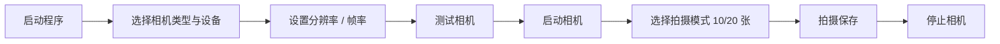

# DepthVision-Plus

3D 深度相机数据采集系统。基于 Python 与 Tkinter 的桌面 GUI 程序，支持 Intel RealSense 与 USB 相机，实时采集 RGB 与深度数据，按会话自动组织存储，拍摄过程带语音提示。

## 目录

- [功能特性](#功能特性)
- [环境依赖](#环境依赖)
- [快速上手](#快速上手)
- [使用说明](#使用说明)
- [数据结构](#数据结构)
- [项目架构](#项目架构)
- [本地开发与调试](#本地开发与调试)
- [故障排查](#故障排查)
- [参与贡献](#参与贡献)
- [许可证](#许可证)

## 功能特性

- **双相机支持**：Intel RealSense（深度流 + 彩色流自动对齐）与普通 USB 相机
- **实时预览**：RGB 图像与深度图并行显示；USB 相机模式下基于边缘检测生成深度估计图
- **会话化管理**：每次采集自动创建独立会话目录，按 rgb / depth / depth_vis / metadata 分目录存储
- **多种拍摄模式**：10 张 / 20 张连拍，拍摄过程语音提示
- **多参数可配置**：分辨率 320x240 至 1920x1080，帧率 15 / 30 / 60 fps
- **现代化界面**：卡片式布局，左侧控制面板 + 右侧实时预览 + 底部状态栏，内置调试信息面板

## 环境依赖

| 依赖 | 版本 | 说明 |
|---|---|---|
| Python | 3.12 | 需图形界面环境（Tkinter） |
| opencv-python | >= 4.8.1 | 相机采集与图像处理 |
| numpy | >= 1.24.0 | 深度数组处理 |
| Pillow | >= 10.0.0 | 图像显示与圆角处理 |
| pygame | >= 2.5.0 | 音效播放 |
| pyrealsense2 | >= 2.55.0 | 可选，仅 Intel RealSense 相机需要 |

支持操作系统：Windows 10/11、macOS、Linux。

## 快速上手

### 1. 创建环境

使用 conda（推荐）：

```bash
conda create -n camera_system python=3.12
conda activate camera_system
```

或使用 venv：

```bash
python -m venv camera_env
# Windows
camera_env\Scripts\activate
# macOS / Linux
source camera_env/bin/activate
```

### 2. 安装依赖

```bash
pip install "opencv-python>=4.8.1" "numpy>=1.24.0" "Pillow>=10.0.0" "pygame>=2.5.0"
# 可选：启用 Intel RealSense 支持
pip install "pyrealsense2>=2.55.0"
```

### 3. 运行

```bash
python Camera.py
```

## 使用说明

### 基本操作流程



1. 运行 `python Camera.py` 启动程序
2. 在控制面板选择相机类型（自动检测 / Intel RealSense / USB 相机）与设备
3. 设置分辨率与帧率
4. 点击「测试相机」确认设备可用
5. 点击「启动相机」开始实时预览，程序自动创建会话目录
6. 选择 10 张或 20 张拍摄模式
7. 点击「拍摄保存」逐张采集，拍满一组后自动进入下一组
8. 点击「停止相机」结束会话，写入会话统计信息

### 音频提示（重要）

拍摄过程会播放四类音效：OK（拍摄确认）、Change（模式切换）、LastOne（最后一张）、Next（下一组）。

**当前版本中，音效路径在 `Camera.py` 的 `capture_and_save()` 内为硬编码的 Windows 绝对路径（`D:\python project\ReadCamera\*.wav`），不会自动读取仓库根目录下的 wav 文件。若音频路径无效，触发音效时保存流程会抛异常并中断。**

启用方式：将 `Camera.py` 中四处 `pygame.mixer.music.load(...)` 的路径改为本机实际路径（仓库根目录的 `*.wav` 即为音效素材），或改为基于项目目录的相对路径。

### 界面功能

| 区域 | 功能 |
|---|---|
| 相机设置 | 相机类型、设备选择、分辨率、帧率 |
| 控制按钮 | 刷新设备、测试相机、启动 / 停止相机、拍摄保存 |
| 拍摄模式 | 20 张模式（第 10 张提示切换）、10 张模式（第 5 张提示切换） |
| 文件管理 | 打开当前会话文件夹 / 全部会话文件夹 |
| 调试信息 | 实时显示相机检测、配置状态、拍摄操作与错误日志 |
| 显示区域 | RGB 图像与深度图像实时预览 |
| 状态栏 | 系统状态、已保存计数、当前会话名 |

## 数据结构

程序启动后在项目根目录创建 `deepdata/`，采集数据按会话组织：

```
deepdata/
├── sessions/                          # 会话数据
│   └── session_YYYYMMDD_HHMMSS/       # 单次采集会话
│       ├── rgb/                       # RGB 图像（PNG）
│       ├── depth/                     # 原始深度数组（NPY）
│       ├── depth_vis/                 # 深度可视化图像（PNG）
│       ├── metadata/                  # 单帧元数据（JSON）
│       └── session_info.json          # 会话统计与配置
├── exports/                           # 导出数据
└── temp/                              # 临时文件
```

- **RGB 图像**：PNG 格式，原始彩色图像
- **深度数据**：NPY 格式；RealSense 模式为真实深度值，USB 模式为边缘检测生成的深度估计
- **深度可视化**：PNG 格式，JET 伪彩深度图
- **元数据**：JSON，含拍摄参数、时间戳与相对文件路径
- **会话信息**：JSON，含起止时间、时长、相机配置与总拍摄数

## 项目架构

单文件程序，入口为 `Camera.py`：

| 模块 / 组件 | 职责 |
|---|---|
| `DepthCameraGUI` | 核心类：初始化、GUI 构建、相机控制、采集保存 |
| 相机层 | RealSense 模式（`rs.pipeline` + 深度/彩色对齐）与 OpenCV 模式（多后端探测，含 Windows DSHOW / MSMF） |
| 数据层 | 会话目录创建、RGB / 深度 / 元数据写入、会话信息统计 |
| 音频层 | pygame 音效播放（路径硬编码，见「使用说明 - 音频提示」） |
| 工具方法 | 圆角图像、悬停按钮样式、调试日志输出 |

运行入口为 `main()`：创建 `tk.Tk()` 根窗口并进入 `mainloop`，窗口关闭时自动停止相机并结束会话。

## 本地开发与调试

- 左侧调试面板实时输出相机检测、配置状态、拍摄操作与错误信息，同时打印到 stdout
- USB 相机启动时依次尝试 DSHOW、MSMF、ANY 后端，自动选择首个可用的
- 未安装 `pyrealsense2` 时程序自动降级为 OpenCV 模式，启动时打印警告，不影响运行
- 修改代码后直接运行 `python Camera.py` 即可验证

## 故障排查

| 问题 | 排查方向 |
|---|---|
| 相机无法检测 | 检查连接与驱动，更换 USB 端口，点击「刷新设备」 |
| RealSense 相机异常 | 确认已安装 pyrealsense2，检查 SDK 版本与相机固件 |
| 拍摄保存失败 | 优先检查音频文件路径是否有效（见「使用说明 - 音频提示」） |
| 界面无法显示 | 确认系统支持 GUI（Tkinter），检查显卡驱动 |

## 参与贡献

个人项目，欢迎通过 GitHub Issue 反馈问题、通过 Pull Request 提交改进。

## 许可证

MIT License。
